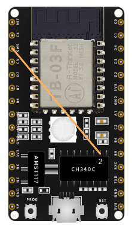
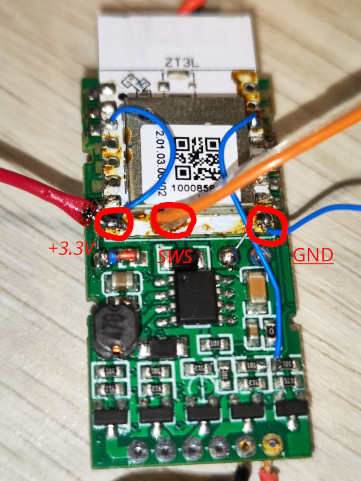
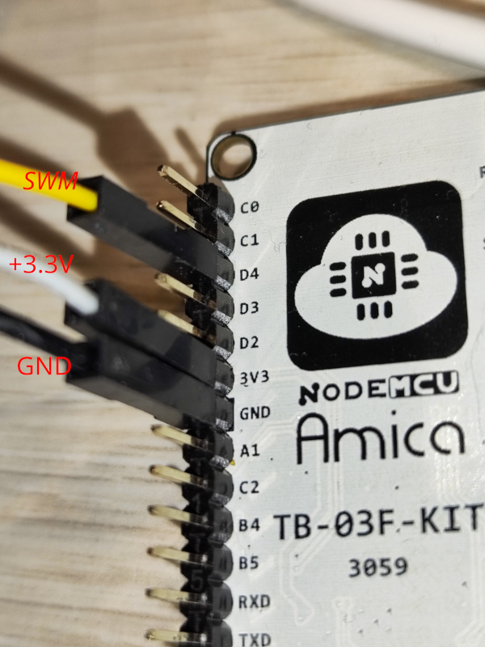

## Zigbee Button

### Getting started

#### Prerequisites

TB-03F module from AiThinker

#### Write programmer (Linux)

1. connect the SWS pin to pin 2 of CH340 of the TB-03F



2. connect TB-03F to computer and find which port the TB-03F is connected to with `ls /dev/tty*` (mine is `/dev/ttyUSB1`)
3. go to programmer-directory and run `python TlsrComProg.py -p <port> -t5000 we 0 uart2swire.bin` with replacing `<port>` with the port of the TB-03F found in previous step. Output:

```
================================================
TLSR825x Floader version 27.12.23
------------------------------------------------
Open /dev/ttyUSB1, 230400 baud...
Reset module (RTS low)...
Activate (5000 ms)...
Warning: Wrong RX-TX connection?
Connection...
Load <floader.bin> to 0x40000...
Bin bytes writen: 1960
CPU go Start...
------------------------------------------------
ChipID: 0x5562 (TLSR8253), Floader ver: 1.1
Flash JEDEC ID: c86013, Size: 512 kbytes
------------------------------------------------
Inputfile: uart2swire.bin
Write Flash data 0x00000000 to 0x00000dfc...
------------------------------------------------
(1) Warning
```

4. disconnect SWS pin to pin 2 of CH340

Credits to [TLSRPGM](https://github.com/pvvx/TLSRPGM)

#### Flashing

1. connect ZT3L to TB-03F




SWS     <-->    SWM (D4))
+3.3V  <-->    +3.3V
GND     <-->    GND

Credits to [tuyaZigbee](https://github.com/doctor64/tuyaZigbee)

##### Test connection

Running `python TlsrPgm.py -s -p <port> i` should give you an output like this:

```
=======================================================
TLSR82xx TlsrPgm version 27.04.21
-------------------------------------------------------
Open /dev/ttyUSB1, 230400 bit/s... ok
PGM: ChipID: 0x5562 (TLSR825x), ver: 0.0.0.1
swdiv 5, addrlen 3, swbuf [5a 00 06 02 00 05], pwr On
SWire bit rate: 0.9600 Mbits/s
=== PreProcess ========================================
CPU Stop... ok
=== Process ===========================================
Chip TLSR825x ID: 0x5562, rev: 0x02
CPU PC=0x00000000 ([0x0602] = 0x05)
Flash JEDEC ID: 0xC86014, Size: 1024 kbytes
-------------------------------------------------------
FLASH UID:
000000: 41 50 32 4b 32 39 39 16 01 39 00 bd ff ff ff ff 
000010: c8 01 ff ff ff ff ff ff ff ff ff ff ff ff ff ff 
-------------------------------------------------------
FLASH:
000000: 41 80 00 00 00 00 00 00 4b 4e 4c 54 00 08 88 00 
000010: ae 80 00 00 00 00 00 00 0c 6a 00 00 00 00 00 00 
-------------------------------------------------------
ANALOG REGISTERS:
000000: 48 4c a2 4f 48 02 ff 1d 05 00 00 38 c6 80 00 54 
000010: 0c c0 00 00 00 00 00 00 00 00 00 00 00 00 00 40 
000020: 54 00 00 00 00 00 00 00 00 00 00 2e 1f 15 00 00 
000030: 20 12 63 80 80 20 00 00 00 ff 00 00 00 00 00 00 
000040: be ec 16 00 80 00 00 00 00 00 00 00 ff ff ff 0f 
000050: 00 00 00 00 00 00 00 00 00 00 00 00 00 00 00 00 
000060: 00 00 00 00 00 00 00 00 00 00 00 00 00 00 00 00 
000070: 00 00 00 00 00 00 00 00 00 00 00 00 00 00 00 01 
000080: 48 4c a2 4f 48 02 ff 1d 05 00 00 38 c6 80 00 54 
000090: 0c c0 00 00 00 00 00 00 00 00 00 00 00 00 00 40 
0000a0: 54 00 00 00 00 00 00 00 00 00 00 2e 1f 15 00 00 
0000b0: 20 12 63 80 80 20 00 00 00 ff 00 00 00 00 00 00 
0000c0: d8 ec 16 00 80 00 00 00 00 00 00 00 ff ff ff 0f 
0000d0: 00 00 00 00 00 00 00 00 00 00 00 00 00 00 00 00 
0000e0: 00 00 00 00 00 00 00 00 00 00 00 00 00 00 00 00 
0000f0: 00 00 00 00 00 00 00 00 00 00 00 00 00 00 00 01 
-------------------------------------------------------
REGISTERS:
000060: 00 00 c0 ff 1f 37 20 00 02 00 02 00 01 02 1f 00 
000070: 00 04 00 04 00 00 00 00 00 00 00 64 00 02 62 55 
```

##### Write flash

Please note that the actual firmware starts from address 0x8000. To write new firmware execute `python TlsrPgm.py -w -t 1 -a 20 -s -p/dev/ttyUSB0 we 0x8000 TuyaLight.bin` You should get output
